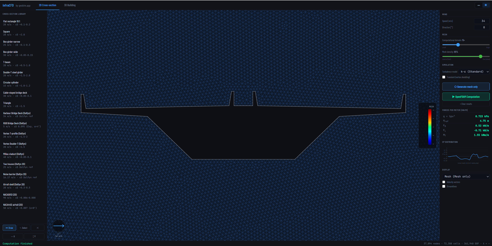
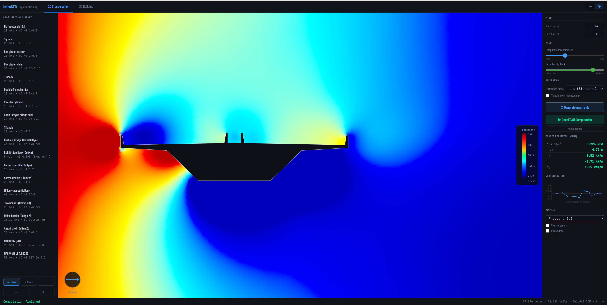
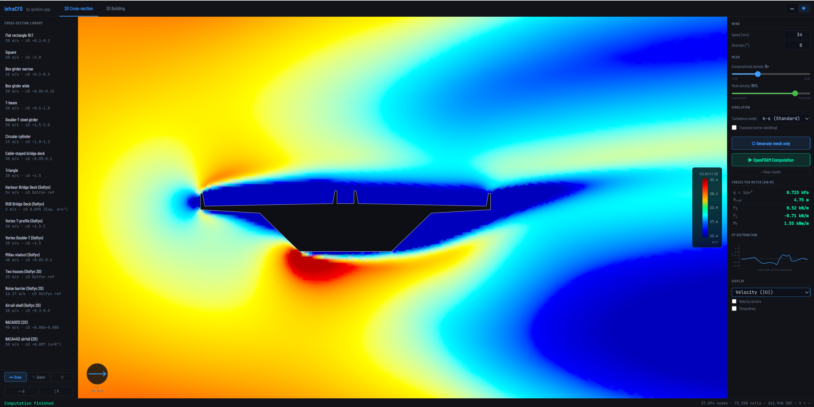
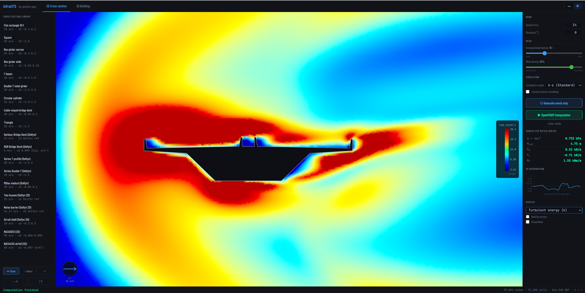

# infraCFD

**[infracfd.app](https://infracfd.app)** — browser-based wind analysis for civil engineering structures, powered by OpenFOAM.

**2D** — cross-section aerodynamics (bridge decks, building profiles)  
**3D** — building aerodynamics (single buildings or entire city blocks) *(experimental)*

Draw a geometry in the browser, hit run, get pressure fields, velocity slices and streamlines — no pre-processing scripts, no local CFD installation beyond OpenFOAM (Linux or WSL).

> By [geobim.app](https://geobim.app)  
> The live app at [infracfd.app](https://infracfd.app) is **password-protected** to limit CFD load — **self-host** it (see [Requirements](#requirements)) or request access.  
> Cross-sections and 3D geometries derived from the [SOFiSTiK Dolfyn](https://www.sofistik.com) CFD example library.

### Status — v0.1.0

This first release focuses on the tested, supported path: **2D cross-section
aerodynamics, steady RANS.** All 19 built-in 2D cases run end-to-end and the
solver is validated against published benchmarks (see [Validation](#validation)).

**Experimental / roadmap** (present in the UI, marked *beta*, maturing in later
releases): **3D building CFD** (snappyHexMesh) and **transient solving**
(pimpleFoam / vortex shedding). Use with care — not yet benchmark-validated.

> Note: the **NACA airfoil** cases run but their drag (cd) is unreliable with the
> k-ε model at high Re — treat them as lift/flow demos, not cd validation. Bluff,
> separating bodies need **k-ω SST** (selectable in the UI) for trustworthy lift.

---

## Gallery

*Harbour Bridge deck — 2D cross-section, steady RANS (k-ε).*

<table>
<tr>
<td align="center"><br><sub>Automatic mesh (Gmsh)</sub></td>
<td align="center"><br><sub>Pressure</sub></td>
</tr>
<tr>
<td align="center"><br><sub>Velocity |U|</sub></td>
<td align="center"><br><sub>Turbulent kinetic energy k</sub></td>
</tr>
</table>

---

## Stack

| Layer | Technology |
|---|---|
| Frontend | Vanilla JS, Three.js (no framework) |
| Backend | Python, FastAPI |
| Meshing | Gmsh (Python API) |
| Solver | OpenFOAM 2412 (Linux or WSL) — steady/transient RANS; selectable k-ε, RNG k-ε, realizable k-ε, k-ω SST |

---

## Requirements

- Python 3.10+
- Linux (or WSL/Ubuntu) with OpenFOAM 2412 (`simpleFoam`, `pimpleFoam`, `snappyHexMesh`, `gmshToFoam` on PATH)
- Gmsh (`pip install gmsh`)
- scipy, numpy, trimesh

**Install OpenFOAM (Ubuntu/WSL):**
```bash
sudo sh -c "wget -q -O - https://dl.openfoam.com/add-debian-repo.sh | bash"
sudo apt install openfoam2412-default
# then source it (add to ~/.bashrc):
source /usr/lib/openfoam/openfoam2412/etc/bashrc
```

---

## Quickstart

```bash
git clone https://github.com/christof2304/infracfd.git
cd infracfd
pip install -r requirements.txt
pip install gmsh
```

**Windows (double-click):**
```
start-server.bat
```

**Or from terminal:**
```bash
uvicorn server.app:app --reload --port 8000
```

Then open **http://localhost:8000/cfd/**

---

## Features

### 2D Cross-Section
- Draw any polygon directly in the browser
- Automatic Gmsh mesh with boundary layer refinement
- Steady RANS or transient solve, selectable turbulence model (k-ε, RNG k-ε, realizable k-ε, k-ω SST)
- Pressure, velocity, vorticity, turbulent kinetic energy
- Client-side RK4 streamlines
- Force coefficients Cd / Cl

### 3D Building *(experimental — roadmap)*
- Footprint-based building extrusion
- Multi-building city block support
- Atmospheric boundary layer inlet (z₀-dependent log profile)
- Horizontal + vertical result slices with interactive slider
- Slice streamlines traced client-side (RK4 on cut plane)
- Force coefficients Cd / Cl / Cm

### General
- Wind angle, terrain roughness (z₀) and domain size configurable
- Live solver log stream (Server-Sent Events)
- Three.js 3D viewer with isometric OrthographicCamera

---

## Validation

infraCFD's OpenFOAM pipeline has been cross-checked against published benchmarks
and the SOFiSTiK/Dolfyn example library, using identical input parameters.

| Case | Quantity | infraCFD | Reference | Source |
|---|---|---|---|---|
| **DFG cylinder, Re=20** (laminar) | c_d / c_l / Δp | 5.580 / 0.0108 / 0.1155 | 5.5795 / 0.0106 / 0.1172 | Schäfer & Turek 1996 |
| **RUB bridge deck**, α=4° (k-ω SST) | c_d / c_l / c_m | 0.098 / 0.358 / 0.118 | 0.095 / 0.380 / 0.109 | wind tunnel (rub_bridge.dat) |

The DFG laminar benchmark is reproduced essentially exactly; the RUB deck matches
the wind tunnel within a few percent. Note that the standard **k-ε** model severely
under-predicts bridge-deck lift — **k-ω SST** is required (and is selectable in the
UI). See the case notes in `cfd-testcases.js`.

---

## Project Structure

```
cfd/            Browser app (HTML + JS)
  index.html    Entry point
  app.js        Main application logic
  viewer3d.js   Three.js 3D viewer + slice rendering
  draw2d.js     2D polygon drawing canvas
  cfd-testcases.js  Built-in example cases

tools/
  cfd_openfoam.py   OpenFOAM case generation, ABL inlet, force coefficients
  cfd_mesh.py       2D Gmsh mesh generation

server/
  app.py        FastAPI server (CFD endpoints only)

three/          Three.js (bundled, no npm required)
```

---

## License

**GPLv3** — see [LICENSE](LICENSE) and [NOTICE](NOTICE).

infraCFD uses the **Gmsh Python API** (`import gmsh`) for mesh generation. Gmsh is
GPL-licensed, and linking against its API makes the combined work subject to the
GPL — so infraCFD is released under **GPLv3**, which is compatible with both Gmsh
(GPLv2+) and OpenFOAM (GPLv3). OpenFOAM itself is invoked as a separate external
program (subprocess).

Dependencies are **not** redistributed — install them separately (see Requirements).
Third-party components and example-data licenses (Three.js MIT, CesiumMan CC-BY 4.0,
SOFiSTiK/Dolfyn-derived test cases, DFG benchmark) are listed in [NOTICE](NOTICE).
